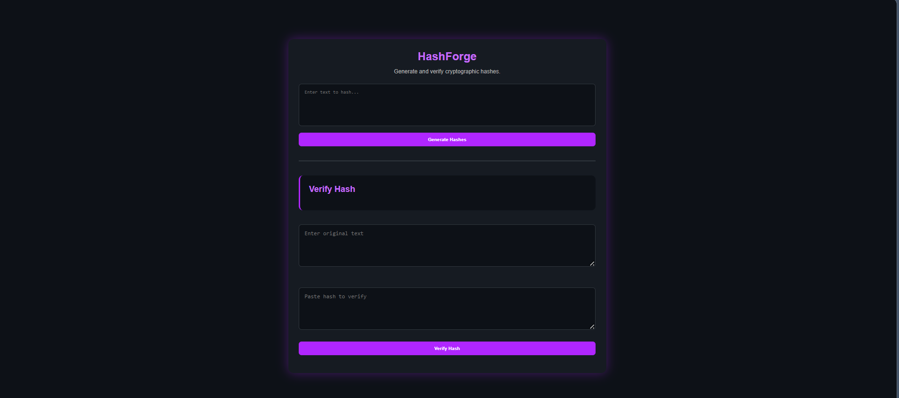
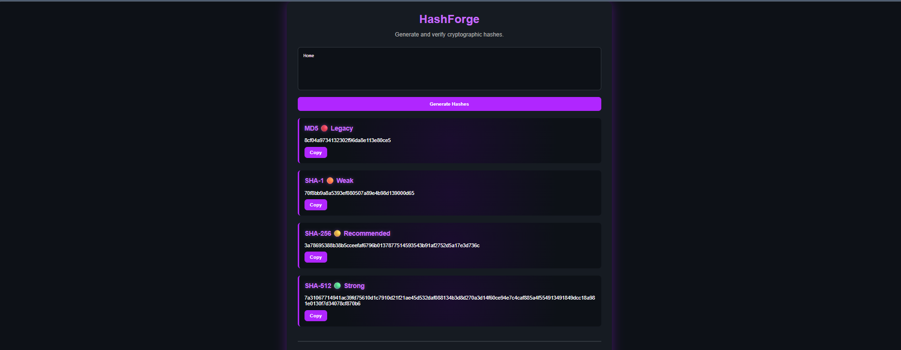

#    HashForge 

A cybersecurity-focused web application for generating and verifying cryptographic hashes.

---

## Features

 - Generate MD5 hashes

 - Generate SHA-1 hashes

 - Generate SHA-256 hashes

 - Generate SHA-512 hashes

 - Verify hashes against original text

 - Copy hash values instantly

 - Enter key support

 - Security classification labels

 - Cyber-themed purple interface

---

## Supported Algorithms

| Algorithm | Status |
|------------|----------|
| MD5 | Legacy |
| SHA-1 | Weak |
| SHA-256 | Recommended |
| SHA-512 | Strong |

---

## Technologies Used

- HTML5
- CSS3
- JavaScript
- Web Crypto API
- CryptoJS

---

## Screenshots

### Home Screen



### Hash Generation



### Hash Verification


---

## How To Run

1. Clone the repository

```bash
git clone https://github.com/Mishen-BMA/HashForge.git
```

2. Open the project folder

3. Open `index.html`

4. Start generating and verifying hashes

---

## Project Purpose

HashForge was built to strengthen practical understanding of cryptographic hashing algorithms and secure software development concepts while creating a useful cybersecurity utility.

---

## Author

**Mishen**

Cybersecurity Student | CTF Player | Builder

Team: Bug Bouncers

---

## Future Improvements

- File hash generation
- Drag & drop file support
- SHA-3 support
- Hash export functionality
- Dark/Light theme switching

---

⭐ If you found this project useful, consider giving it a star.